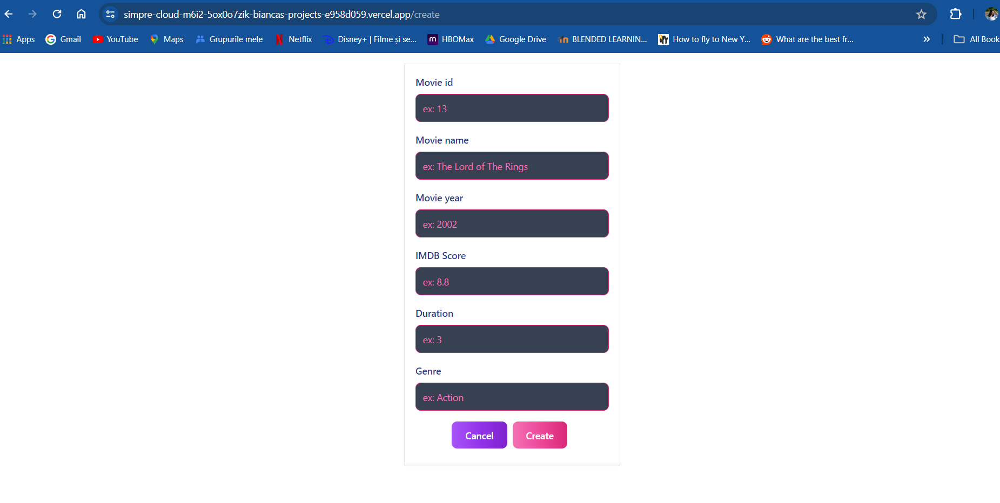

Documentație 

1. Introducere 

Scopul principal al aplicației dezvoltate constă în gestionarea eficientă a unei baze de date ce conține informații detaliate despre FILME. Aceste date includ numele filmului, anul in care a apărut, scorul/rating pe IMDB, precum si durata filmului în minute și tipul acestuia (acțiune, crimă, mister etc.). Prin utilizarea MongoDB, o bază de date non-relațională, împreună cu serviciile de hosting furnizate de Vercel, aplicația facilitează manipularea rapidă și eficientă a datelor într-un mediu Cloud optimizat pentru aplicații frontend. Obiectivul principal este de a oferi o interfață ușor de utilizat, accesibilă global, cu posibilitatea de vizualizare și prelucrare a datelor. Aplicația se bazează pe două produse de tip Cloud: baza de date non-relațională MongoDB și hostarea proiectului este asigurată de Vercel.

2.  Descriere problemă 

 Misiunea centrală a aplicației este de a oferi acces rapid și în siguranță informații complexe și variate despre un număr semnificativ de filme, peste 2000, având în vedere securitatea și performanța. Deoarece vorbim de secolul viztezei și al volumului extrem de mare de date, trebuie avut în vedere o organizare eficientă care să faciliteze utilizatorilor accesul, actualizarea și analiza datelor într-un mod cât mai simplu posibil. De asemenea, s-a dorit crearea unei aplicațtii cât mai intuitive și ușor de folosit.

3. Descriere API 

API-ul aplicației (https://simpre-cloud-m6i2-5ox0o7zik-biancas-projects-e958d059.vercel.app/api/records) este organizat pentru a oferi acces la operațiunile CRUD (Create, Read, Update, Delete) asupra datelor stocate în baza de date MongoDB. Aplicația utilizează framework-ul Next.js și serverul implicit pentru a gestiona rutele și datele.
 Endpoints:
- GET /records - furnizează o listă cu toate filmele si toate detaliile din baza de date MongoDB.
- POST /records - adaugă în bază un film nou.
- GET /records/{id} - returnează detalii despre filmul specificat cu id-ul.
- PUT /records/{id} - actualizează datele despre un film deja existent, identificate prin id.
- DELETE /records/{id} - șterge filmul identificat cu id-ul.

4. Flux de date 

 Utilizatorii trimit cereri HTTP către serverul backend, care rulează pe platforma Next.js. Acest server procesează și răspunde la cereri prin intermediul bazei de date MongoDB. Aplicația este găzduită de Vercel.

Exemple de cereri și răspunsuri:

Cerere: GET /records 
Răspuns:
{"_id":"66393daab43049143f10b75d","movie_id":93,"movie_title":"Guardians of the Galaxy ","title_year":2014,"imdb_score":8.1,"duration":121,"genre":"Action"},

Metode HTTP folosite în interacțiunea cu API-ul:
- GET - pentru a obține date despre filme.
- POST - pentru a adăuga filme noi.
- PUT - pentru a actualiza filmele existente.
- DELETE - pentru a șterge filmele.

5. Capturi ecran aplicație 

6. Referințe

https://vercel.com/blog/what-is-vercel

https://www.ibm.com/topics/rest-apis

https://www.techtarget.com/searchdatamanagement/definition/MongoDB

Prezentarea workflow-ului aplicației printr-o înregistrare video (maxim 5 minute) salvată pe YouTube la categoria 'Nelistat' 

https://youtu.be/10ltxnm4JRY

